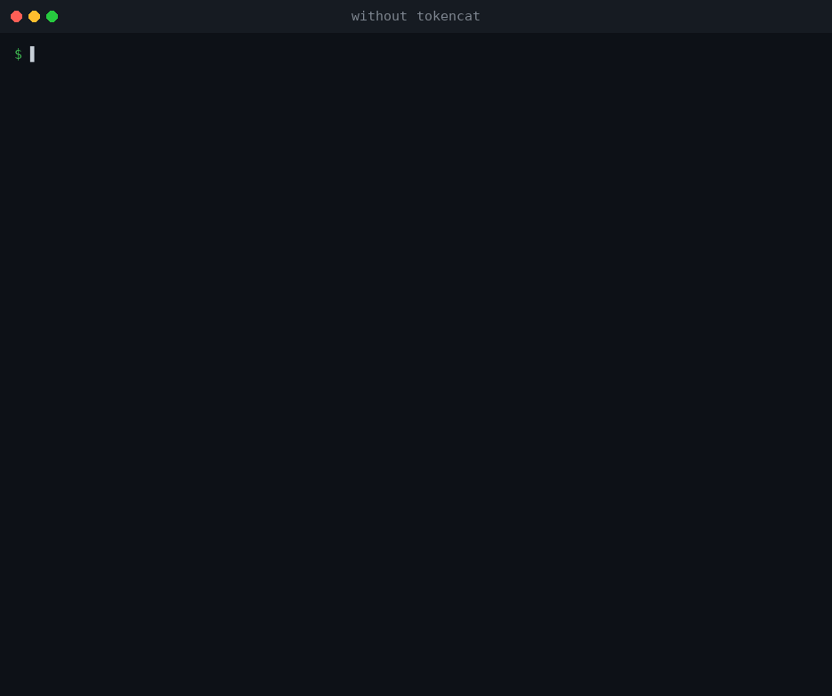

# tokencat

**Test and compiler output, pruned down to what an AI coding agent needs.**

Coding agents like Claude Code, Aider, Codex and Cursor read every byte of the
commands they run. A single `pytest -v` can push 70,000 tokens of `PASSED`
lines, progress bars and ANSI escape codes into the context window, crowding
out the code the agent is working on and costing real money every time it
re-runs the suite.

`tokencat` sits between the test runner and the agent. It strips the noise,
recognises the tool, keeps only the failures (message, diff, the stack frames
that matter and the lines of source where it broke) and prints a short
Markdown report. The exit code is passed through untouched.



````console
$ tokencat run -- cargo test
## ✗ cargo: 1 failed, 33 passed (exit 101)

### 1. test_tilde
at tests/test_version_req.rs:25:9
did not match 1.2.4
  at tests/test_version_req.rs:194:5 in test_version_req::test_tilde
```rust
 22 | fn assert_match_all(req: &VersionReq, versions: &[&str]) {
 23 |     for string in versions {
 24 |         let parsed = version(string);
>25 |         assert!(req.matches(&parsed), "did not match {}", string);
 26 |     }
 27 | }
```

[tokencat: 1,132 -> 164 tokens (-85.5%) | saved ~$0.0039 | full log: /tmp/tokencat/1791047533-305.log]
````

## Install

Prebuilt binaries for Linux (x86_64, arm64, static musl), macOS (Intel,
Apple silicon) and Windows (x86_64) are attached to every
[release](https://github.com/OWNER/tokencat/releases).

```sh
curl -fsSL https://raw.githubusercontent.com/OWNER/tokencat/main/install.sh | sh
```

or with a Rust toolchain:

```sh
cargo install --locked --git https://github.com/OWNER/tokencat
```

It is a single ~2.7 MB binary with no runtime dependencies.

## Usage

```sh
tokencat run -- pytest -x tests/        # run a command, prune, keep its exit code
tokencat run -- "npm test && go vet ./..."  # one quoted string runs through the shell
go test ./... 2>&1 | tokencat           # filter a pipe
tokencat build.log                      # filter a file
```

**Prefer `tokencat run`.** It runs the command in a pseudo-terminal (so tools
behave exactly as they do in your terminal, minus colours), lets Ctrl-C
reach the command, and exits with the command's exact exit code, including `128+N` when the
command is killed by signal N. That is what lets an agent, or `make`, or CI,
still tell pass from fail. In pipe mode tokencat itself always exits 0, and
your shell reports the exit code of the last command in the pipeline.

Anything that is not a recognised test runner (linters, type checkers,
`make`, `docker build`, a crashing script) goes through the generic parser,
which keeps lines that look like errors (`error:`, `fatal:`, `Exception`,
`Traceback`, `file.ext:line:col`) with three lines of context on each side
and drops the rest. The generic parser passes short outputs (30 lines or
fewer) through unchanged.

### Options

| Flag | Env | Default | |
|---|---|---|---|
| `-e, --engine` | `TOKENCAT_ENGINE` | auto | Force `pytest`, `jest`, `vitest`, `go`, `cargo` or `generic` |
| `-C, --context N` | | 3 | Context lines around each error (generic parser) |
| `--snippet-lines N` | `TOKENCAT_SNIPPET_LINES` | 5 | Source lines attached per failure, 0 to disable |
| `--max-failures N` | `TOKENCAT_MAX_FAILURES` | 10 | Failures shown in full; the rest are listed by name |
| `--max-lines N` | | 150 | Cap on lines kept by the generic parser |
| `--small N` | | 30 | Outputs up to N lines are passed through |
| `--price USD` | `TOKENCAT_PRICE` | 4 | Input price per million tokens, for the savings line |
| `--log-dir DIR` | `TOKENCAT_LOG_DIR` | `$TMPDIR/tokencat` | Where the full log is saved |
| `--no-log` | | | Never save the full log |
| `--no-stats` | | | Hide the savings line |
| `--raw` | | | Only strip escape codes and progress redraws, keep every line |
| `run --no-pty` | | | Capture with plain pipes instead of a pseudo-terminal |
| `hook claude` | | | Run as a Claude Code hook (see below) |
| | `TOKENCAT_DISABLE=1` | | Pass everything through untouched |

## Using it with coding agents

### Claude Code

The most reliable setup is a hook: tokencat itself rewrites test and build
commands before Claude Code runs them, so nothing depends on the model
remembering an instruction. Add to `.claude/settings.json` (project) or
`~/.claude/settings.json` (all projects):

```json
{
  "hooks": {
    "PreToolUse": [
      {
        "matcher": "Bash",
        "hooks": [{ "type": "command", "command": "tokencat hook claude" }]
      }
    ]
  }
}
```

With it, `pytest -x 2>&1 | tail -40` becomes `tokencat run -- pytest -x` and
`cd web && npm test` becomes `tokencat run -- 'cd web && npm test'`. The hook
only touches commands it recognises (pytest, unittest and Django, jest,
vitest, npm/yarn/pnpm test, go test/build/vet, cargo test/build/check/clippy,
tsc, mypy, make test) and leaves anything with pipes to other programs,
redirections, `;` or `$(…)` alone. It never approves a command on its own:
Claude Code's normal permission rules apply to the rewritten command.

Because those rules now see `tokencat run -- …`, allow the specific test
commands you were already allowing, for example:

```json
{
  "permissions": {
    "allow": [
      "Bash(tokencat run -- pytest *)",
      "Bash(tokencat run -- npm test *)"
    ]
  }
}
```

Do not allow `Bash(tokencat run *)`: tokencat runs whatever command it is
given, so that rule would approve every command.

Without the hook, add one line to your project's `CLAUDE.md` instead:

```markdown
Always run tests as `tokencat run -- <test command>`, for example `tokencat run -- pytest`.
```

### Aider

Aider runs your test command after each edit and sends failures back to the
model, which is exactly the output tokencat shrinks. In `.aider.conf.yml`:

```yaml
test-cmd: tokencat run -- pytest
auto-test: true
```

The same works for `lint-cmd`.

### Codex, Cursor and other agents

Put the same instruction in `AGENTS.md`, `.cursorrules` or whatever file your
agent reads:

```markdown
Always run tests as `tokencat run -- <test command>`.
```

### Nothing is lost

When lines were pruned, the complete (de-ANSI'd) output is written to a log
file and its path is printed in the savings line, so the agent can read the
full log if the summary is not enough:

```
[tokencat: 75,867 -> 483 tokens (-99.4%) | saved ~$0.302 | full log: /tmp/tokencat/1791047543-472.log]
```

tokencat also never makes things worse:

- If its report would be longer than the output it replaces (a run that was
  already terse), it prints the cleaned-up output as is, plus the source
  lines for each error.
- Lines over 1,000 characters (minified bundles, JSON dumps, base64 blobs)
  keep their first 700 and last 200 characters.
- If a parser fails on unexpected output, it prints the cleaned-up full
  output instead of a partial report.
- `TOKENCAT_DISABLE=1` turns it into a transparent pass-through, hook
  included, without editing any agent configuration.

## Supported tools

| Tool | Detected from | What is kept |
|---|---|---|
| **pytest** | default, `-v`, `-q`, `--tb=long/short/line/no` | Failures and errors (setup, teardown, collection), `E` lines with assertion diffs, user stack frames, captured output |
| **unittest** | `python -m unittest`, Django's `manage.py test` and `runtests.py`, any verbosity | `FAIL`/`ERROR` blocks with the re-runnable test id and subtest parameters, assertion diffs, user frames, chained exceptions |
| **Jest** | default and `--verbose` | `●` failure blocks, expected/received diffs, the code frame, user stack frames |
| **Vitest** | `vitest run` | Failure sections, diffs, the `❯` location and code frame |
| **go test** | plain and `-v`, `./...` | Failing tests with their `file:line:` messages, panics with user frames, build errors per package |
| **cargo** | `cargo test`, `cargo build` | Compiler errors with their source excerpt, test panics with location and message, user frames from `RUST_BACKTRACE` |
| **anything else** | generic fallback | Error-looking lines with context, a condensed Python/Node traceback, the tail of the output |

For every failure tokencat finds the file on disk (even when the tool printed
an absolute path from CI or a container, or only a bare file name like Go
does) and attaches a few lines around the failing line, plus the enclosing
function signature when it is further up:

```python
 4 | def test_filename_formatting():
   | ⋮
 6 |     assert click.format_filename(b"/x/foo.txt") == "/x/foo.txt"
 7 |     assert click.format_filename("/x/foo.txt") == "/x/foo.txt"
>8 |     assert click.format_filename("/x/foo.txt", shorten=True) == "foo.txt"
 9 |     assert click.format_filename("/x/�.txt", shorten=True) == "�.txt"
```

Paths are shown relative to the project, and frames inside `node_modules`,
`site-packages`, the Go runtime or the Rust standard library are dropped.

## Benchmark

Real open-source test suites at pinned commits, each with a one-line bug
injected ([`bench/patches`](bench/patches)), run the way an agent runs them
(no TTY, stdout and stderr combined), then piped through tokencat.
Reproduce with `python3 bench/bench.py`.

| Scenario | Lines | Tokens (est.) | Saved | Wall time |
|---|---:|---:|---:|---:|
| [click](https://github.com/pallets/click) · pytest | 145 → 38 | 2,295 → 479 | 79.1% | 3.3 ms |
| click · pytest -v | 2,343 → 38 | 73,863 → 479 | 99.4% | 9.2 ms |
| click · pytest -v (all pass) | 117 → 2 | 3,116 → 14 | 99.6% | 2.3 ms |
| [cobra](https://github.com/spf13/cobra) · go test ./... | 39 → 64 | 980 → 860 | 12.2% | 3.4 ms |
| cobra · go test -v ./... | 851 → 64 | 14,036 → 864 | 93.8% | 5.0 ms |
| [semver](https://github.com/dtolnay/semver) · cargo test | 93 → 16 | 1,133 → 160 | 85.9% | 3.6 ms |
| [ms](https://github.com/vercel/ms) · jest | 1,174 → 155 | 12,796 → 1,572 | 87.7% | 3.9 ms |
| [ufo](https://github.com/unjs/ufo) · vitest run | 66 → 36 | 752 → 370 | 50.8% | 2.6 ms |
| [django](https://github.com/django/django) · runtests.py utils_tests | 46 → 35 | 863 → 436 | 49.5% | 3.2 ms |
| django · runtests.py -v 2 utils_tests | 799 → 35 | 20,853 → 436 | 97.9% | 4.2 ms |
| **Total** | | **130,687 → 5,670** | **95.7%** | |

Notes:

- Token counts are tokencat's own estimate (a character-class heuristic), not
  the output of a specific model's tokenizer.
- Wall time is the whole `tokencat` process as measured from Python,
  including process start-up and reading the input. Start-up alone adds
  about 0.5 ms over spawning `/bin/true`.
- Plain `go test` output is already terse, so the source snippets tokencat
  adds can make a short report about as long as the original. You still get
  the failing line and its surroundings without a second round trip.

## How it works

```
 command ──► PTY / pipe capture ──► sanitizer ──► engine detection ──► parser ──► snippets ──► Markdown + savings line
             (exact exit code)     (ANSI, \r,     (pytest, jest,      (failures,  (source from
                                    cursor moves)  vitest, go, cargo,  frames,     disk, function
                                                   generic)            summary)    signature)
```

- **Capture.** `tokencat run` starts the command in a pseudo-terminal sized
  200 columns, with `NO_COLOR=1`, `PY_COLORS=0` and `CARGO_TERM_COLOR=never`
  set unless you already set them. Signals are forwarded, and output from
  background grandchildren cannot hang it. If tokencat itself is stopped
  (an agent's command timeout sends SIGTERM), it stops the command and still
  prints the report for what ran. On Windows the command runs with plain
  pipes for now, and `.cmd` launchers such as `npm` go through `cmd.exe`.
- **Sanitizer.** A small line-oriented terminal emulator: it applies `\r`,
  backspace, cursor movement and erase sequences the way a terminal would, so
  a progress bar that redrew itself 500 times becomes its final line, and it
  drops colour, OSC and DCS sequences.
- **Engines.** Detection scores markers in the output and the command name.
  Each parser understands its runner's layouts (verbose and not, TTY and not)
  and builds a structured report: summary, failures, location, message,
  frames.
- **Snippets.** Locations are resolved against the working directory, the
  window around the failing line is read from disk, and the nearest
  enclosing `def`/`fn`/`func`/`function` signature is added above it.

## Development

```sh
cargo test                         # unit tests, CLI tests, golden outputs
UPDATE_GOLDEN=1 cargo test         # accept changed golden outputs
python3 bench/bench.py --save out  # benchmark (needs git, python3, node, go, cargo)
```

Fixture logs in `tests/fixtures` were captured from real runs of each tool
against the small projects in `tests/fixtures/projects`; `tests/golden` holds
the expected reports. To add a tool or a layout, capture a log, add it as a
fixture and run with `UPDATE_GOLDEN=1`.

`docs/demo.gif` is rendered by `docs/make_demo.py` (needs Pillow) from a raw
log and the matching tokencat report.

Pushing a tag such as `v0.1.0` builds the release binaries and publishes them
with SHA-256 checksums (`.github/workflows/release.yml`).

## License

MIT
